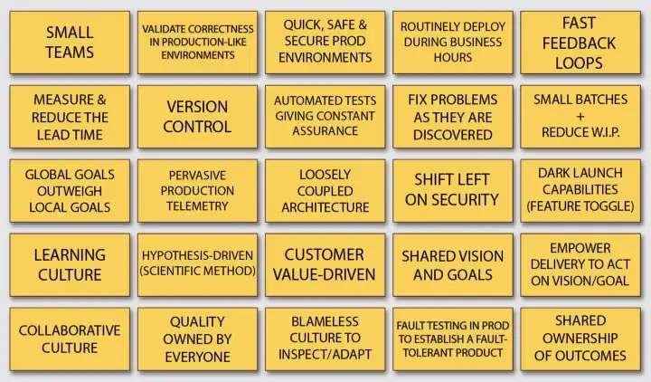

  

The DevOps Handbook: How to Create World-Class Agility, Reliability, & Security in Technology Organizations is a practical roadmap for building high performing IT organizations. It’s written by well known members of the DevOps community: Gene Kim, Jez Humble, John Willis, and Patrick Debois. They distill practical information and experiences in moving towards a DevOps value stream.

The goal of this book is to explain and apply `The Three ways` to the DevOps value steam:

- `Flow`: the first way describes how to maximize the amount of work not done, by optimizing and automating the flow of work through the entire value stream from development to operations.

  1. Make your work visible
  2. Limit work in process (WIP)
  3. Reduce batch sizes
  4. Reduce the number of handoffs
  5. Continually identify and address your bottlenecks
  6. Eliminate hardships and waste in the value stream

- `Feedback`: the principles of feedback are about creating a culture of continuous experimentation and learning, by creating a fast and constant flow of feedback across all functions, in order to drive continuous improvement and optimize the flow of work

  1. Design a safe system of work
  2. See problems as they occur
  3. Swam and solve problems to build new knowledge
  4. Keep pushing quality closer to the source
  5. Enable optimizing for downstream teams

- `Continual learning & experimentation`: the principles of continuous improvement is about creating a culture of continual experimentation and learning, by constantly improving and optimizing the flow of work and creating a culture of continuous experimentation and learning.

  1. Enable an organizational learning and safety culture
  2. Institutionalize the improvement of daily work
  3. Transform local discoveries into global improvements
  4. Inject resilience patterns into our daily work
  5. Leaders reinforce a learning culture

---

## Summary

- `The Three Ways`: A brief history of DevOps, and introduce the underpinning theory and key themes. This section includes the high-level overview of “The Three Ways” (Flow, Feedback, and Continual Learning & Experimentation)

- `Where To Start`: Description of how and when to start DevOps. This section presents concepts including value streams, organization design, organizational patterns, and ways to begin winning hearts and minds in an organization lacking DevOps.

- `The First Way`: The Technical Practices of Flow”: Acceleration of flow by building foundations of deployment pipelines. This includes a detailed look at automated testing, continuous integration (CI), continuous delivery (CD), and architecture for low-risk releases.

- `The Second Way`: The Technical Practices of Feedback”: Acceleration of feedback by creating effective production telemetry (metrics). This section features lessons on perceiving problems prior to their growth, and also creating review and communication processes between Dev & Ops.

- `The Third Way`: The Technical Practices of Continual Learning and Experimentation”: Acceleration of continual learning through culture, reserving time for organizational learning, and processes for globalizing knowledge gained from the first two ways.

- `The Technical Practices of Integrating Information Security, Change Management, and Compliance`: Integration of security, utilizing shared source code repositories and services, enhancing telemetry, protecting the deployment pipeline, and concurrently achieving change management goals.

---

## DevOps good practices

